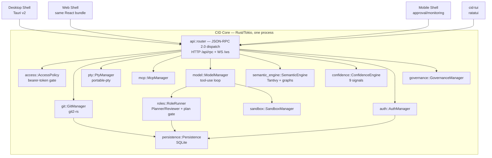

# 004 — System Architecture

## Vision

One Core, many surfaces (Part 15): a single Rust/Tokio daemon owns every stateful
capability — git, PTY, MCP, model routing, persistence, auth — and every shell (desktop,
web, mobile, CLI/TUI) is a thin client of the same JSON-RPC 2.0 API.

## Goals

- A shell can be added without touching Core, and Core capability can be added once and
  reach every shell simultaneously — proven in practice: the CLI/TUI shell (Phase 4) added
  zero new Core RPC methods (ADR 0014).
- Core stays light by default; heavy features (Tree-sitter indexing, semantic search,
  sandboxing) run opt-in per Repo Channel (Part 17).

## Non-Goals

A microservices architecture, a separate backend-for-frontend per shell, or a message
queue between components — Core is one process, in-process `Arc`-shared managers, no
network hop between its own subsystems.

## Architecture

- **Core** (`cid-core/src/lib.rs`): constructs every manager once in `Core::new`/
  `Core::new_in_memory`, holds them as `Arc<T>`, and clones them into `AppState`
  (`cid-core/src/api/router.rs`) for the router to use per-request.
- **Transport**: JSON-RPC 2.0 over HTTP POST (`/api/rpc`) and WebSocket (`/ws`) — the same
  wire shape MCP and ACP already use (Part 15's deliberate consistency choice). WS carries
  push notifications (`mission.message.delta`, `mission.tool_call.request`, `pty.output`,
  etc.); HTTP is request/response for everything else.
- **Desktop Shell**: Tauri v2, wraps the same React bundle as the Web Shell.
- **Web Shell**: `src/components/WebShell.tsx` — connection banner, health dashboard,
  access-control panel reading real Core state (not, as an earlier session's dead code
  briefly had it, local-only UI toggles that enforced nothing).
- **Mobile Shell**: `src/mobile/MobileApp.tsx` — approval/monitoring only, selected by
  platform/viewport in `src/main.tsx`.
- **CLI/TUI Shell**: `cid-tui/` — HTTP polling for state, the existing `/ws` for pending
  approvals (ADR 0014).

## Data Structures

`AppState` (`cid-core/src/api/router.rs`) is the complete list of Core capability exposed
to the router — every manager Core owns, `Arc`-cloned per request. `Core`
(`cid-core/src/lib.rs`) is the equivalent list at the process level, plus `event_tx`
(a `tokio::sync::broadcast::Sender<String>`) used to fan JSON-RPC notifications out to
every connected WS client.

## Traits / Interfaces

No trait-object polymorphism at the manager level — each manager is a concrete struct
behind an `Arc`, chosen deliberately over `dyn Trait` since there is exactly one
implementation of each and the indirection would cost clarity without buying anything
(YAGNI, consistent with Part 0's anti-scaffolding discipline).

## Storage Layout

SQLite only (Phase 0–3 decision, `018-Storage.md`... see `021-Storage.md`), plus a
per-repo Tantivy index on disk under `<repo>/.cid/index` (`semantic_engine/index.rs`).
No RocksDB, no second storage engine — cut from the original stack table for lack of a
workload that needed it (Part 18).

## Performance Targets

Budgets to validate, per Part 17, not specs to fake: <150MB idle with optional features
off, <2s cold start, git status/diff instant under ~50k files. Measured, not asserted —
see Benchmarks below.

## Benchmarks

Real numbers from `cid-core/tests/performance_budget.rs`, run in this environment:

| Measurement | Result | Budget |
|---|---|---|
| Cold start to first `/health` response | 12.5ms | <2s |
| `Core::new_in_memory` construction | well under 500ms | — |
| `git status` on a 50-file repo | 2.99ms | feel-instant |
| 200-file repository scan (Tantivy) | 57.7ms | — |
| 100 concurrent RPC calls | 26ms, 100/100 succeeded | — |

These clear budget comfortably because they run against an in-memory DB with no disk
I/O — a regression floor, not proof of the shipped desktop app's real-world numbers under
disk-backed load (stated plainly in `docs/CHECKPOINT-Phase3.md`).

## Tradeoffs

One process for all of Core's capability means a panic in one manager can, in principle,
take down the whole daemon — accepted because Rust's type system and this project's "no
unwrap without justification" discipline make that failure mode rare in practice, and
because the alternative (separate processes per capability, IPC between them) adds real
operational complexity for a desktop-first tool with no current multi-machine deployment
need.

## Failure Modes

- A manager's internal panic inside a request handler is caught by axum's default panic
  boundary per-request; it does not currently have circuit-breaking or automatic restart.
- Core losing its DB file mid-session is not specifically handled — `rusqlite` errors
  surface as JSON-RPC errors to the caller.

## Security

See `031-Security.md` for the full threat model: `access::AccessPolicy` for transport
auth, `auth`/`governance` for identity and policy, `sandbox` for Autonomous-mode
confinement.

## Testing

`cid-core/tests/api_integration.rs` (56 tests) exercises the router over real HTTP/WS
against a running Core — the same contract every shell depends on.

## Implementation Order

Core's shape (one daemon, JSON-RPC over HTTP+WS) was fixed in Phase 0 and never
restructured — every subsequent phase added managers and RPC methods to the same
skeleton, which is the concrete proof the architecture didn't need to change to
accommodate five phases of real feature growth.

## Acceptance Criteria

A new shell can be added by writing an HTTP/WS client against the existing API and zero
new Core RPC methods for anything Core already exposes — demonstrated by `cid-tui`.

## AI Coding Rules

- New capability goes into a manager in `cid-core/src/<name>/mod.rs`, wired into `Core`
  and `AppState` in both `lib.rs` and `api/router.rs` — both files need the addition, a
  common source of "builds but the field doesn't exist in AppState" errors during this
  project's own development.
- Never add a new transport (gRPC, REST alongside JSON-RPC) without an ADR — Part 18
  already decided this deliberately, not by omission.
