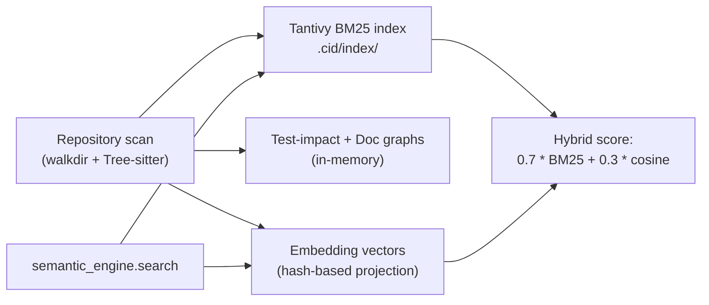

# 007 — Context Engine

## Vision

Ground AI suggestions in the actual codebase via retrieval, not just whatever fits in a
chat window — a tunable repo map (Aider's phrase) rather than a full workspace→knowledge
graph stack on day one.

## Goals

- **Phase 1 ("Structural")**: Tree-sitter symbol/import/reference indexing
  (`cid-core/src/context_engine/mod.rs`, `cid-core/src/analyzer/mod.rs`), off by default
  per Repo Channel.
- **Phase 1**: `AGENTS.md`/`SKILL.md` auto-loaded as Mission context
  (`cid-core/src/skills/mod.rs`, `cid-core/src/context/mod.rs`).
- **Phase 2 ("Semantic")**: embeddings + Tantivy BM25 hybrid retrieval, dependency graph,
  git-blame ownership overlay (`cid-core/src/semantic_engine/mod.rs`).
- **Phase 4**: test-impact and documentation graphs (`006-Repository-Digital-Twin.md`).

## Non-Goals

A full semantic knowledge graph (workspace→repo→package→...→runtime) as a day-one
requirement — the v1.0 ambition this brief explicitly scoped down. HNSW/ANN vector
indexing — the current embedding set is small enough that exact cosine similarity isn't
the bottleneck; premature before there's a corpus that justifies it.

## Architecture

- **Structural engine** (`context_engine/mod.rs`): per-file symbol/import/reference index,
  refreshed incrementally on file change via a filesystem watcher
  (`notify` crate), not a full rescan.
- **Semantic engine** (`semantic_engine/mod.rs`): Tantivy full-text index persisted at
  `<repo>/.cid/index`, survives Core restarts (verified by
  `an_on_disk_index_survives_being_reopened`). Search blends BM25 (normalized against the
  top hit) with embedding cosine similarity.
- **Indexing**: batched Tantivy commits (500 files/batch), overlapping 60-line chunk
  windows with 45-line stride so a symbol near a chunk boundary stays retrievable with
  surrounding context (`semantic_engine/mod.rs::chunk_source`).

## Data Structures

`FileIndex`, `CodeSymbol`, `SymbolKind` (`api/types.rs`) — the structural index's output.
`SearchHit`, `IndexChunk` (`semantic_engine/index.rs`) — the Tantivy layer's types.

## Traits / Interfaces

RPC surface: `context_engine.{status,enable,disable,search,related,file_index,recent}`,
`semantic_engine.{status,enable,disable,search,dependency_graph,git_blame,index_file}`.

## Storage Layout

Tantivy index on disk under the repo's own `.cid/index/` (gitignored automatically on
`repo.connect`). Structural index and dependency graph stay in-memory, rebuilt on enable.

## Performance Targets

A 200-file repository scan completes in 57.7ms in this environment
(`repository_scan_indexes_a_moderate_repo_in_reasonable_time`,
`performance_budget.rs`) — comfortably inside Part 17's "instant under ~50k files"
budget, though that's an in-memory-DB measurement, not a proof of real-world numbers at
that scale.

## Benchmarks

See table above and `004-System-Architecture.md`'s Benchmarks section.

## Tradeoffs

Embeddings are a deterministic hash-based projection, not a learned model — a weak but
real signal, cheap and dependency-free. Real embeddings (via the Phase 2 background model
or a cloud endpoint) are a documented future upgrade, not a current gap hidden as
complete.

## Failure Modes

`SearchIndex::open` failing (read-only checkout, permissions) falls back to the
pre-existing in-memory word-index scan rather than failing the whole engine — logged, not
silent (`RepoIndex::new`'s `warn!`).

## Security

Read-only over repo content already trusted by the user connecting the repo. No new
attack surface beyond what `file.read` already exposes.

## Testing

22 unit tests in `semantic_engine/mod.rs` and `semantic_engine/index.rs`, plus the
persistence-survives-restart test and the real-repository-scan integration test in
`006-Repository-Digital-Twin.md`.

## Implementation Order

Structural (Phase 1) → Semantic hybrid retrieval (Phase 2) → test-impact/doc graphs
(Phase 4). Each layer built on the prior one's real output, not a parallel reimplementation.

## Acceptance Criteria

`semantic_engine.search` returns real BM25-ranked results from a live-scanned repository,
verified end-to-end, not just unit-tested against fixtures.

## AI Coding Rules

Off by default per Repo Channel (Part 17) — never flip this default without a documented
reason; heavy indexing running unasked is exactly the "everything on by default" failure
mode Part 17 exists to prevent.
