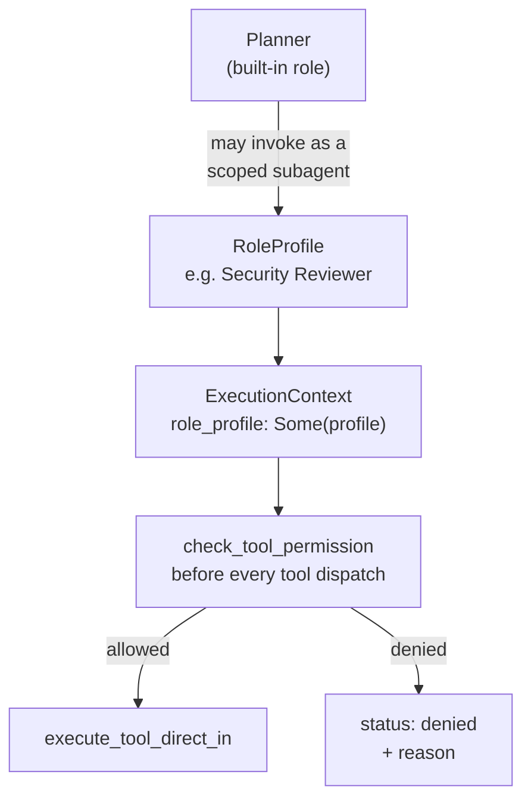

# 008 — Agent Operating System

## Vision

Documents the **scoped resolution** of the "AI Operating System" proposal (ten named
agents — Planner, Architect, Developer, Reviewer, QA, Security, Performance,
Documentation, DevOps, Release — each with independent memory, context, tools, model,
budget, and permissions).

## Goals

Kept as **configurable role profiles** on top of the existing three-role engine, not ten
independent agent subsystems. A profile is still a prompt + tool-permission set + model
config running through the same Session, worktree, and model router — never its own
independent subsystem. `cid-core/src/role_profiles/mod.rs`.

## Non-Goals

Independent per-role memory/budget/permission subsystems — the single highest-risk item
in the original proposal, because it's the literal thing v1.0 asked for and the founding
brief already carries dated evidence for why it fails first (Cursor's subagents, Devin
Local, Junie's plan-then-implement split all converged on one core loop plus spawned
scoped workers, not a fixed cast of named employees).

## Architecture



Three built-in roles (Planner, Implementer, Reviewer — `cid-core/src/roles/mod.rs`) are
unchanged. A `RoleProfile` is an *additional*, named, Workspace- or Repo-scoped
configuration a Session's Planner can invoke as a scoped subagent when the task calls for
it — "this touches auth code, also run the Security Reviewer profile."

## Data Structures

```rust
pub struct RoleProfile {
    pub id: String, pub name: String, pub scope: ProfileScope,  // Workspace | Repo
    pub system_prompt: String,
    pub model_provider: Option<String>, pub model_id: Option<String>,
    pub allowed_tools: Vec<ToolPermission>,  // ReadFile | WriteFile | RunTerminal | GitOps | McpTools
}
```

`ExecutionContext` (`model/mod.rs`) carries an optional `role_profile: Option<RoleProfile>`
— `None` means the default unrestricted path; `Some` means every tool call is checked
against `allowed_tools` before dispatch.

## Traits / Interfaces

RPC: `role_profile.{create,update,delete,get,list,check_permission}`.

## Storage Layout

`role_profiles` table in SQLite, scoped by `(scope, scope_id)` — see `035-Database.md`.

## Performance Targets

Permission check is a `Vec::contains` over at most five enum variants — no measurable
cost.

## Tradeoffs

Enforcement lives in the tool-execution path (`model::execute_tool_direct_in`), checked
*before* dispatch — not merely exposed as a checkable RPC a client could ignore. This was
a deliberate choice after the pattern of "restriction displayed but not enforced" showed
up elsewhere in this project's history (the Phase 2 Web Shell's original access-control
panel).

## Failure Modes

An unrecognized tool name maps to the strictest real category (`WriteFile`) rather than
defaulting to allowed — fails closed, verified by
`an_unrecognized_tool_name_fails_closed`.

## Security

A restricted profile is genuinely restricted: verified end-to-end (not just at the
manager level) by `a_read_only_profile_is_denied_a_write_call` in `model/mod.rs`, which
calls the real `execute_tool_direct_in` path and confirms the file is never created.

## Testing

11 tests in `role_profiles/mod.rs` (creation, scoping, permission logic) + 3 in
`model/mod.rs` (real enforcement through the tool-execution path).

## Implementation Order

Built in Phase 4 on top of Phase 0's three-role engine — no architecture change to the
underlying Session/worktree/model-router machinery was needed.

## Acceptance Criteria

A profile with restricted `allowed_tools` cannot perform a tool call outside that set,
proven by an integration test that exercises the real dispatch path, not a standalone
permission-check unit test alone.

## AI Coding Rules

Do not add a tenth named agent identity with its own memory/budget system — if the ask
resembles that, it should become a `RoleProfile` instead, per this document's own
resolution.
