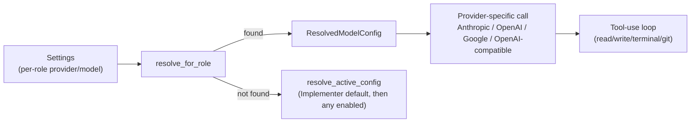

# 009 — Model Scheduler (Model Routing)

## Vision

Route each role's chat/tool-use loop to the right model — cloud or local, premium or
cheap — without hand-building a bespoke integration per provider.

## Goals

- **Foreground model** (Phase 0–1): Anthropic (Phase 0), plus OpenAI, Google, and one
  generic OpenAI-compatible slot (Phase 1) — covers OpenRouter, Groq, Bedrock-compatible
  proxies, vLLM, and most self-hosted setups through one interface.
  `cid-core/src/model/mod.rs`.
- **Per-role selection**: Planner/Implementer/Reviewer can each use a different
  provider/model, resolved fresh on every call so a mid-Mission provider swap takes effect
  immediately (`resolve_for_role`, `resolve_active_config`).
- **Local runtime detection** (Phase 1): Ollama, LM Studio, `llama.cpp --server`
  (`cid-core/src/local_models/mod.rs`) — detection and listing only; hardware-gated
  filtering is a Phase 2+ reconsideration point, not yet built.
- **Background/ambient model** (Phase 2): routes low-stakes work (summaries, commit
  messages, cheap-tier execution) to a detected local runtime without driving the main
  agent loop (`cid-core/src/background_model/mod.rs`).

## Non-Goals

Nine named cloud providers hand-integrated on day one — scoped down to three named plus
one generic slot with equivalent real-world coverage (Part 6).

## Architecture

Streaming responses use provider-native SSE/streaming APIs; tool calls interleave with
text deltas and are persisted as `ChatMessage.tool_calls`.

## Data Structures

`ModelProvider` (enum: Anthropic/OpenAI/Google/OpenAICompatible/Ollama/LmStudio/LlamaCpp),
`ResolvedModelConfig` (`model/mod.rs`), `AgentRole` (Planner/Implementer/Reviewer).

## Traits / Interfaces

RPC: `model.list`, `model.chat`, `local.runtime.{list,detect}`,
`background_model.{status,configure,submit_task,list_tasks}`.

## Storage Layout

Per-role provider/model settings in the `settings` SQLite table; API keys in OS-native
credential storage via `keyring`, never in SQLite plaintext (`api/router.rs`'s
`redact_key`/keyring integration).

## Performance Targets

No hard latency budget currently enforced; Part 17 targets ≤3s chat round-trip, not
independently benchmarked in this environment (network-dependent, excluded from the
in-process performance suite for that reason).

## Tradeoffs

`complete_text` (a non-streaming, tool-free completion used by Planner/Reviewer) shares
provider dispatch logic with the streaming tool-use loop but is a separate code path —
some duplication accepted because Planner/Reviewer's needs (one document out, no tools)
are genuinely simpler than the Implementer's tool loop, and forcing them through the same
abstraction would have complicated both.

## Failure Modes

Missing API key or endpoint degrades to a documented simulated response explaining what
to configure, rather than a bare error — verified by
`settings_never_return_a_full_api_key` and the simulated-response path in
`process_message_with_role`.

## Security

Keys never leave Core in plaintext; `settings.get` redacts to `sk-…abcd`
(`redact_key`). See `031-Security.md`.

## Testing

Provider resolution, fallback chains, and per-role config are covered across
`model/mod.rs`'s test module and `api_integration.rs`'s
`model_list_exposes_all_phase1_providers`, `local_runtime_list_returns_known_runtimes`.

## Implementation Order

Anthropic-only (Phase 0) → multi-provider + local detection (Phase 1) → background model
(Phase 2). Hardware-gated filtering remains a named, not-yet-built Phase 2+
reconsideration point.

## Acceptance Criteria

Swapping a role's provider in Settings takes effect on the next message without a
restart — verified by settings being read fresh on every `process_message_with_role`
call, not cached.

## AI Coding Rules

Never hardcode a provider's endpoint or model ID outside `model/mod.rs`'s known-model
tables — every other module should go through `resolve_for_role`/`resolve_active_config`.
