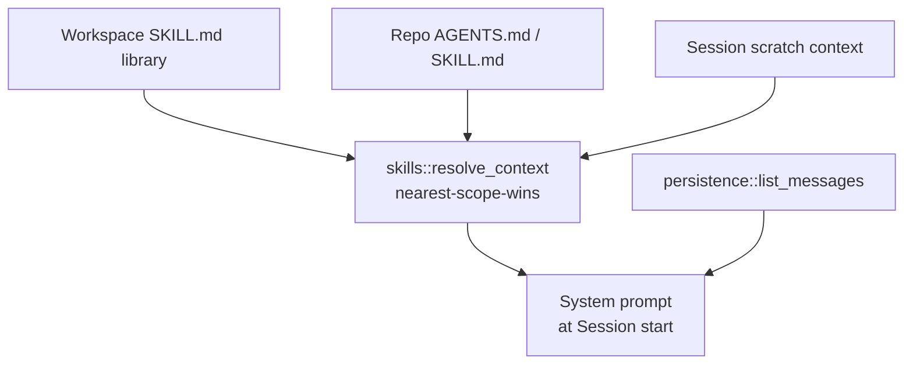

# 010 — Memory System

## Vision

Give agents the context they need without a separate "memory" subsystem — CID's memory
is the same layered context/history data already visible in the product (Part 12's
Skills layering, Part 13's History panel), not a hidden agent-only store.

## Goals

- **Context layering** (Part 12): Workspace `SKILL.md` library → Repo Channel
  `AGENTS.md`/`SKILL.md` → Session Thread scratch notes, nearest-scope-wins, assembled
  fresh at Session start by `skills::resolve_context` / the `skills.resolve` RPC.
- **Chat history**: every message persisted per-Session (`persistence::create_message`,
  `list_messages`), forming the model's conversation context on each turn.
- **Action History** (Part 13): every tool call, terminal command, and approval decision
  logged, filterable, exportable — `013-Repository-Health.md` covers this in more depth.
- **Ephemeral Session context**: plain scratch notes scoped to one Session, cleared/
  archived on close, never written back to the repo.

## Non-Goals

A persistent vector-based "agent memory" that survives across unrelated Sessions —
CID's memory is scoped to what's visible in the product (a Session's own history, a
repo's own files), not a hidden cross-Session store an agent silently accumulates.

## Architecture

## Data Structures

`Skill`, `SkillBundle`, `SkillScope` (Workspace/Repo) — `api/types.rs`. `ChatMessage`
carries the actual conversational memory per Session.

## Traits / Interfaces

RPC: `skills.{list,save,bundles.list,bundle.write,resolve}`, `message.list`,
`repo.agents_md`, `repo.agents_md.write`.

## Storage Layout

`skills` table (DB-backed Workspace/Repo skills) plus real `SKILL.md`/`AGENTS.md` files
on disk — CID writes back to the actual files in the repo rather than forking the format
into a database-only representation (Part 12's explicit differentiator: a team adopting
CID doesn't migrate anything).

## Performance Targets

Context resolution is a handful of file reads plus string concatenation — not separately
benchmarked; not currently a bottleneck at Session-start scale.

## Tradeoffs

No embedding-based "relevant memory retrieval" across a Session's history — the full
message list is passed as context each turn. Simple and correct at current conversation
lengths; would need summarization/truncation at much longer Session threads, not yet
built because not yet needed.

## Failure Modes

A missing `AGENTS.md` or empty Skills library degrades to an empty context section, not
an error — `skills_resolve_returns_a_layered_context_stack` covers the populated case;
the empty case is the default and untested explicitly, a reasonable gap to note rather
than hide.

## Security

Skills/AGENTS.md content is treated as trusted (it's the user's own repo content) but
flows into model context — same trust boundary as any other file content sent to a
model provider.

## Testing

`skills_resolve_puts_session_context_last`, `skills_bundles_list_finds_multi_file_skill_md`,
and related tests in `api_integration.rs` cover resolution order and multi-file bundle
discovery.

## Implementation Order

Minimal markdown snippets (Phase 0) → full multi-file `SKILL.md` bundles (Phase 1) → no
further change through Phase 4 — the resolution model proved stable.

## Acceptance Criteria

A Skill added at the Workspace level appears in a Repo Channel's resolved context beneath
that repo's own `AGENTS.md`, which takes precedence on any overlapping instruction — Flow
3 from the founding brief.

## AI Coding Rules

Never invent a new context-storage location outside the three documented scopes
(Workspace/Repo/Session) — a fourth ad hoc scope would break the "nearest-scope-wins"
guarantee every caller depends on.
