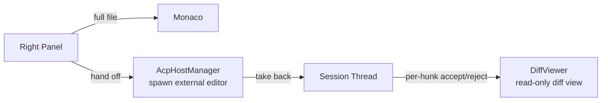

# 012 — Semantic Editing

## Vision

The editing surfaces a human uses inside a Session: inline quick edits in the thread,
a full file editor, and — via ACP — a full external IDE when the task calls for it. Not a
from-scratch editing engine; see `018-Native-Editor.md` for why.

## Goals

- **Full file editor**: Monaco, in the right panel (`src/components/editor/EditorPane.tsx`).
  **Correction (2026-07-27, `050-Gold-Standard-Review.md` F5):** a CodeMirror 6 inline
  editor for quick diff-hunk tweaks was planned here and in `018-Native-Editor.md`, but
  never built — there is no `codemirror` dependency anywhere in this repository. Monaco
  is the only editor CID actually ships. `DiffViewer.tsx`'s per-hunk accept/reject is a
  read-only diff view with accept/reject buttons, not an inline editable surface.
- **Pop-out via ACP**: a Session's session can hand off to Zed or a JetBrains IDE for
  someone who wants deeper IDE power, and hand back — `023-MCP.md`'s sibling protocol,
  covered in `cid-core/src/acp/mod.rs`.
- **Per-hunk accept/reject**: `git.hunk.apply` RPC. Reject performs a real per-hunk
  reverse patch (`reverse_apply_hunk`, `cid-core/src/api/router.rs`) using the hunk's own
  header and content as returned by `git.diff` — the earlier file-level
  `git checkout HEAD -- <file>` behavior (which discarded every other hunk in the file on
  a single reject) was replaced; see `review_prompt.md` §6.

## Non-Goals

A native rendering engine. See `018-Native-Editor.md`.

## Architecture

## Data Structures

`AcpEditor`, `AcpHandoff`, `AcpHandoffStatus` (Idle → HandedOff → InExternalEditor →
Returned/Failed) — `api/types.rs`, `acp/mod.rs`.

## Traits / Interfaces

RPC: `acp.{editors.list,handoff,take_back,handoffs.list,handoff.get,handoff.remove}`,
`git.hunk.apply`.

## Storage Layout

Handoffs tracked in-memory (`Arc<RwLock<HashMap>>` in `AcpHostManager`) — a Session's
handoff history doesn't need to survive a Core restart, since the external editor
process itself doesn't either.

## Performance Targets

Editor detection (`list_editors_async`) runs on the blocking thread pool to avoid
stalling the async runtime while probing PATH and common install locations.

## Tradeoffs

No inline (CodeMirror) editing surface exists — Monaco alone, opened to the relevant file,
is the only way to hand-edit anything in CID today. That's a real gap for the "hand-tweak
one hunk without leaving the thread" workflow the original design intended, not a
deliberate scoping decision; `051-Editor-Excellence-Roadmap.md` does not currently
prioritize rebuilding it (Monaco-only is judged the better product than two overlapping
editors — see that document's Wave 2.2).

## Failure Modes

A handoff to an editor that isn't actually installed fails with a clear message
(`editor.available` checked before spawn) rather than a silent hang.

## Security

Spawning an external editor process uses `tokio::process::Command` with the Session's
worktree path as an argument — no shell interpolation, so a crafted worktree path can't
inject additional arguments.

## Testing

`acp_editors_list_returns_known_editor_ids`, `acp_handoff_rejects_unknown_session`, and
related tests in `api_integration.rs`; `acp/mod.rs`'s own unit tests for editor
detection.

## Implementation Order

Monaco embedding (Phase 0) → ACP host (Phase 1) → real per-hunk reverse-apply reject
(review_prompt.md §6) → no further change through Phase 6.

## Acceptance Criteria

A detected, installed external editor can be handed a Session's worktree and receive
control; taking back marks the handoff Returned without forcibly killing the external
process (a deliberate choice — the user may still want that editor open).

## AI Coding Rules

Do not add per-hunk true-reverse-patch logic without updating this document's Tradeoffs
section — it's the one place that limitation is currently documented for a new
contributor to find.
