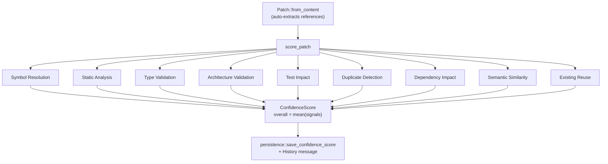

# 014 — Patch Verification (Confidence Engine)

## Vision

For every AI-authored patch, before it's presented for human review: compute and surface
a score with a plain-language explanation, from nine independently visible signals — not
a bare number, and not an agent just saying "looks good." Cross-reference
`015-Test-Impact-Analysis.md` — the Test Impact signal is one of the nine and shares its
underlying graph with that document.

## Goals

Nine signals (`cid-core/src/confidence/mod.rs::ConfidenceSignal`):

1. **Symbol Resolution** — do referenced symbols actually resolve in the repo?
2. **Static Analysis** — heuristic pattern scan (see Tradeoffs — not literally `clippy`).
3. **Type Validation** — heuristic scan for `any`-typing, unsafe-without-SAFETY-comment.
4. **Architecture Validation** — structured `AGENTS.md` rules (see Architecture below).
5. **Test Impact** — which tests cover the touched symbols (shares `TestImpactGraph`
   with `015-Test-Impact-Analysis.md`).
6. **Duplicate Detection** — does the patch reimplement a symbol that exists elsewhere?
7. **Dependency Impact** — how many other files reference the touched symbols?
8. **Semantic Similarity** — token-overlap similarity against existing repo content.
9. **Existing Implementation Reuse** — does the patch reuse vs. reinvent common patterns?

Each signal returns a `SignalResult { score: f64, explanation: String, details }` —
rendered individually in the UI (`src/components/confidence/ConfidenceCard.tsx`), never
collapsed into one opaque number, per the founding brief's explicit requirement.

## Non-Goals

A general-purpose architecture-conformance solver — the Architecture Validation signal
deliberately handles only simple, explicit, backtick-delimited path rules
(`` `src/ui` must not import `src/storage` ``), not free-text sentence understanding.

## Architecture

**Architecture Validation, specifically**: `ArchitectureRule` parses only backtick-pair
rules from `AGENTS.md` into an enforceable shape (`path_pattern`, `forbidden_import`).
A rule that mentions architecture but doesn't name two backticked paths is recorded as
**informational only** — it appears in the rules list but can never flag a patch. This
design exists specifically to prevent false confidence: an earlier version of this
signal used unstructured keyword matching and had two real bugs (see Failure Modes) that
made it either always-wrong or never-actually-checking-the-patch.

## Data Structures

`ConfidenceSignal`, `SignalResult`, `ConfidenceScore`, `Patch`, `ArchitectureRule`
(`confidence/mod.rs`). `Patch::from_content` auto-extracts call-shaped identifier
references from source content, excluding definition sites (`fn name(` is a definition,
not a reference) and language keywords.

## Traits / Interfaces

RPC: `confidence.score`, `confidence.history`.

## Storage Layout

`confidence_scores` table, one row per score, full `ConfidenceScore` JSON blob plus
indexed `mission_id`/`overall` for querying (`persistence::save_confidence_score`).

## Performance Targets

Not independently benchmarked; bounded by a single `analyze_directory` scan per score,
same cost class as the Context Engine's own scan.

## Tradeoffs

**Static Analysis and Type Validation are heuristic pattern scans, not real `clippy`/
`eslint`/`tsc` invocations**, despite the founding brief's Part A phrasing ("does it pass
clippy for Rust"). A real tool invocation was considered and rejected for this phase:
`cargo clippy` on a real crate takes tens of seconds, too slow for an interactive
per-patch score, and would need per-package manifest resolution to scope correctly. The
heuristic scan is honest about what it is in its signal explanations ("heuristic scan
found N potential issues") — not overstated as a real linter run. Named as a real gap for
a future phase, not hidden.

## Failure Modes

**Found and fixed during Phase 4 implementation — this file was dead code (never wired
into `lib.rs`) and had never actually been compiled before this pass.** Real bugs found:

1. `check_architecture_rules` ignored its own `patch` parameter (`_patch: &Patch`) and had
   a Rust operator-precedence bug (`&&` binds tighter than `||`) that flagged *any*
   `AGENTS.md` line containing "must not" or "never" as a violation on *every* patch,
   regardless of relevance — and, when no such line existed, confidently reported "respects
   all configured architecture boundaries" despite never inspecting the patch. This is the
   textbook false-confidence failure mode the whole feature exists to prevent.
2. `score_existing_reuse` used `?` on a value that wasn't a `Result` (compile error).
3. `score_patch`'s explanation generation used `signals` after it had already been moved.
4. `extract_symbols_from_content` didn't recognize `pub fn` (only bare `fn`), so duplicate
   detection missed the common case.
5. `verdict()` recomputed from `signals` via `overall_score()` instead of using the
   already-computed, authoritative `overall` field — a `ConfidenceScore` with `overall: 0.9`
   but an empty `signals` vec (a legitimate summary-view shape) reported "very low
   confidence," contradicting the number shown next to it.

All five fixed and covered by regression tests specifically named for the bug they catch
(e.g., `an_unrelated_agents_md_rule_does_not_flag_an_unrelated_patch`).

## Security

Architecture rule matching uses substring containment, not code execution — no injection
risk from a crafted `AGENTS.md`.

## Testing

28 unit tests in `confidence/mod.rs` covering all nine signals, the backtick-rule
parser, `Patch::from_content`'s reference extraction, and the overall-score/verdict
consistency. 3 integration tests in `api_integration.rs` covering the full RPC path
including reading a file from the worktree when no content is supplied.

## Implementation Order

Built and wired in Phase 4 as its centerpiece deliverable, after being found unwired
(dead code) from an earlier session's work.

## Acceptance Criteria

A patch that violates a real, structured architecture rule is flagged; a patch that
merely happens to share vocabulary with an unrelated rule is not — the specific
distinction the original bug got backwards.

## AI Coding Rules

If you touch `check_architecture_rules` or `ArchitectureRule::check`, re-run
`an_unrelated_agents_md_rule_does_not_flag_an_unrelated_patch` and
`a_real_import_boundary_violation_is_caught` specifically — together they are the
regression pair proving false-positive and false-negative are both actually prevented.
