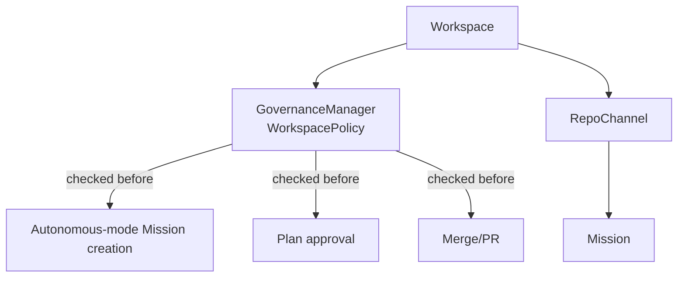

# 017 — Workspace Manager

## Vision

The top-level container: Workspace → Repo Channel → Mission Thread navigation, plus (from
Phase 3) multi-user membership and governance policy scoped to a Workspace.

## Goals

- **Workspace**: connector directory (MCP servers, model providers), Skills library,
  user accounts and roles (Phase 3+).
- **Repo Channel**: `repo.{connect,list,get,disconnect}` — auto-detects `AGENTS.md`,
  pins enabled MCP servers as a least-privilege subset of the Workspace's full registry.
- **Governance** (Phase 3): `WorkspacePolicy` — who may enable Autonomous mode, which
  repos permit it, plan-approval and merge role bars, spend caps
  (`cid-core/src/governance/mod.rs`).

## Non-Goals

Multiple simultaneous Workspaces in the UI — Phase 0–4 is single-Workspace-at-a-time by
product design (Part 24's default), not a technical ceiling.

## Architecture

## Data Structures

`Workspace`, `RepoChannel` (`api/types.rs`); `WorkspacePolicy`, `PolicyDecision`,
`SpendRecord` (`governance/mod.rs`).

## Traits / Interfaces

RPC: `workspace.{list,get}`, `repo.*`, `governance.policy.{get,set}`,
`governance.check.{autonomous,plan_approval,merge}`, `governance.spend.{check,record,summary}`.

## Storage Layout

`workspaces`, `repo_channels` tables; governance policy currently in-memory
(`GovernanceManager`'s `RwLock<HashMap>`), not yet persisted to SQLite — a real gap: a
Core restart resets Workspace policy to defaults. Named honestly here since it isn't
obvious from the RPC surface alone.

## Performance Targets

Not separately benchmarked; policy checks are in-memory map lookups.

## Tradeoffs

Governance policy defaults are deliberately restrictive (Autonomous mode off, no repo
allow-listed) rather than permissive — a Workspace must opt in explicitly, which is safer
but means the in-memory-only persistence gap above resets to the *safe* default on
restart, not an unsafe one. Mitigates the severity of the gap without excusing it.

## Failure Modes

Governance policy is lost on Core restart (see Storage Layout) — every policy check
after a restart reflects defaults until an Admin re-configures. A real, named limitation.

## Security

Every governance check requires a valid session and enforces the actor's role — verified
by `only_an_admin_can_change_governance_policy` and
`creating_an_autonomous_mission_is_refused_by_default_policy`.

## Testing

13 unit tests in `governance/mod.rs`; 6 integration tests in `api_integration.rs`
covering the real enforcement points (Mission creation, plan approval).

## Implementation Order

Repo Channel/Workspace basics (Phase 0) → governance/roles (Phase 3) → no further change
through Phase 4.

## Acceptance Criteria

Autonomous mode is refused by default and only permitted once a Workspace Admin
explicitly enables it for a specific repo and the acting user's role clears the
configured bar — verified end-to-end.

## AI Coding Rules

If you persist `WorkspacePolicy` to SQLite, update this document's Storage Layout and
Failure Modes sections — this is a known, intentionally-flagged gap waiting for that fix.
