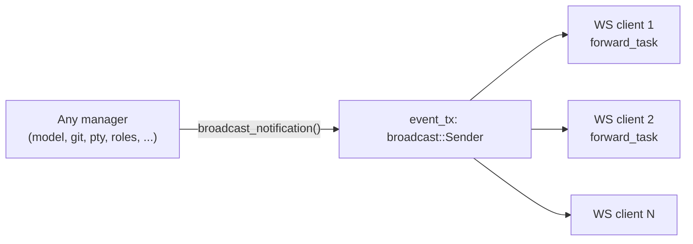

# 022 — Event Bus

## Vision

Push real-time updates (streaming chat deltas, PTY output, diff changes, plan/review
completion) to every connected client without polling — a single in-process broadcast
channel, not a message queue.

## Goals

`Core.event_tx: tokio::sync::broadcast::Sender<String>` — every manager that produces an
event a client should see immediately sends a serialized `JsonRpcNotification` on this
channel. Every connected WebSocket client subscribes via `event_tx.subscribe()` and
forwards matching notifications (`handle_ws`'s `forward_task`, `api/router.rs`).

## Non-Goals

An external message broker (Redis pub/sub, NATS, etc.) — unnecessary for a single-process
Core; the in-process broadcast channel is sufficient at current scale and adds no
operational dependency.

## Architecture

Notification methods used across the codebase: `mission.message.delta`,
`mission.message.complete`, `mission.tool_call.request`, `mission.tool_call.complete`,
`mission.plan.changed`, `mission.review.completed`, `mission.blocked`, `pty.output`,
`git.diff.update`, `confidence.scored`, `deployment.recorded`,
`governance.policy.changed`, `tracker.link.changed`, `forge.change_request.created`,
`acp.handoff.changed`.

## Data Structures

`JsonRpcNotification { jsonrpc, method, params }` (`api/types.rs`) — every event on the
bus is this shape, serialized to a JSON string before broadcast (the channel carries
`String`, not a typed enum, so every producer serializes independently — see Tradeoffs).

## Traits / Interfaces

`broadcast_notification(state: &AppState, method: &str, params: Value)` — the shared
helper every RPC handler uses rather than constructing the envelope by hand
(`api/router.rs`).

## Storage Layout

N/A — purely in-memory, ephemeral; a client that reconnects after a gap does not receive
missed notifications (no replay buffer beyond `broadcast::channel`'s own bounded lag
tolerance of 1000 messages).

## Performance Targets

100 concurrent RPC calls complete in 26ms with 100/100 succeeding
(`one_hundred_concurrent_rpc_calls_all_complete`) — a proxy for the bus staying
responsive under real concurrent load, though not a direct measurement of broadcast
fan-out specifically.

## Tradeoffs

The channel carries pre-serialized `String`, not a typed event enum — simpler at the
producer side (`serde_json::to_string` once, send), costs type safety (a malformed
notification would only be caught by a client's own deserialization, not the compiler).
Accepted as proportionate to the number of producers and the low cost of a JSON shape
mismatch being caught in integration tests.

## Failure Modes

A client that never reads from its receiver could fall behind the broadcast channel's
1000-message buffer and start missing notifications (`broadcast::error::RecvError::Lagged`)
— not specifically handled with a resync mechanism; the client would need to re-fetch
state via a normal RPC call to recover, which every shell's own polling/refresh logic
already does as a matter of course.

## Security

Notifications carry the same content as their originating RPC response would — no
additional data exposure beyond what a client with API access could already see.

## Testing

Exercised indirectly by every test that relies on a notification firing (e.g.
`confidence_score_is_computed_and_logged_to_the_mission` implicitly depends on the
`confidence.scored` broadcast, though the test asserts on the persisted/returned data
rather than subscribing to the WS channel directly).

## Implementation Order

Built in Phase 0, extended with new notification methods as each phase added new
event-producing capability — no structural change to the bus itself.

## Acceptance Criteria

A WebSocket client connected to Core receives real-time notifications for Mission-scoped
events without polling.

## AI Coding Rules

Use `broadcast_notification` for every new event type rather than constructing
`JsonRpcNotification` by hand — keeps the wire format consistent across the ~15 existing
notification methods.
