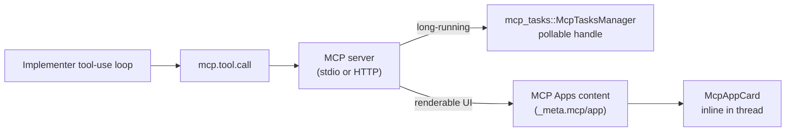

# 023 — MCP (Model Context Protocol)

## Vision

CID is an MCP client, targeting the 2026-07-28 spec revision (stateless core, MCP Apps,
Tasks extension, OAuth/OIDC alignment) — connecting Session agents to external tools and
data sources without a bespoke integration per tool.

## Goals

- **Basic client** (Phase 0): add a server via UI (stdio or HTTP), agent can call its
  tools, calls render as inline cards and log to History
  (`cid-core/src/mcp/mod.rs`).
- **Tasks extension** (Phase 2): long-running tool calls return a pollable/subscribable
  handle instead of blocking (`cid-core/src/mcp_tasks/mod.rs`).
- **MCP Apps** (Phase 2): a server's rendered UI (forms, choice cards, dashboards)
  displays natively inline (`src/components/McpAppCard.tsx`,
  `extractMcpAppContent`), rather than being flattened to text.

## Non-Goals

Building a general-purpose plugin runtime beyond MCP itself — see `024-Plugin-SDK.md` for
why a separate plugin SDK wasn't built.

## Architecture

## Data Structures

`McpServer`, `McpTool`, `McpTaskHandle` (`api/types.rs`).

## Traits / Interfaces

RPC: `mcp.server.{add,list,remove}`, `mcp.tools.list`, `mcp.tool.call`,
`mcp.task.{create,poll,subscribe,cancel,list}`.

## Storage Layout

`mcp_servers` table, connection config persisted, credentials via `keyring` where
applicable.

## Performance Targets

Long-running calls use the Tasks extension specifically to avoid blocking the agent loop
— no fixed timeout budget documented beyond the Tasks manager's own configurable timeout
(300s default, `mcp_tasks/mod.rs`).

## Research

The 2026-07-28 MCP spec revision — donated to the Linux Foundation's Agentic AI
Foundation alongside `goose` and `AGENTS.md`, release-candidate-locked May 21 2026,
finalizing July 28 2026 — is real, dated, external protocol work CID targets rather than
invents. Building against the RC rather than the superseded 2025-11-25 shape was a
deliberate Phase 0 decision (Part 2 of the founding brief), re-verified as still correct
in the Phase 5 dependency audit.

## Tradeoffs

The stdio transport's full-duplex JSON-RPC framing was documented as an honest stub in
earlier phases (ADR 0005) — real MCP servers over stdio need careful message framing that
wasn't fully built out; HTTP transport is the more completely exercised path. Named here
so a reader of this document knows which transport to trust more.

## Failure Modes

MCP tool calls with hostile arguments (deeply nested JSON, unknown server IDs, path-
traversal-shaped tool names) are handled without panicking Core — verified by
`mcp_tool_calls_with_hostile_arguments_are_handled` and
`mcp_server_registration_rejects_hostile_input_without_panicking` in
`tests/protocol_fuzz.rs` (Part 21's Phase 3+ fuzzing floor).

## Security

MCP servers are enabled per Repo Channel, not globally — least-privilege by default
(Part 8, Part 14). See `031-Security.md`.

## Testing

Unit tests in `mcp/mod.rs` and `mcp_tasks/mod.rs`; protocol-boundary fuzz tests in
`tests/protocol_fuzz.rs`.

## Implementation Order

Basic client (Phase 0) → Tasks extension + MCP Apps rendering (Phase 2) → no further
change through Phase 4.

## Acceptance Criteria

An MCP tool call — including one with malformed or hostile arguments — never crashes
Core, always returns an orderly JSON-RPC response.

## AI Coding Rules

Build against the 2026-07-28 MCP spec shape, not the superseded 2025-11-25 one — this was
a deliberate Phase 0 decision, re-confirmed in the Phase 5 audit, not an oversight to
"fix."
