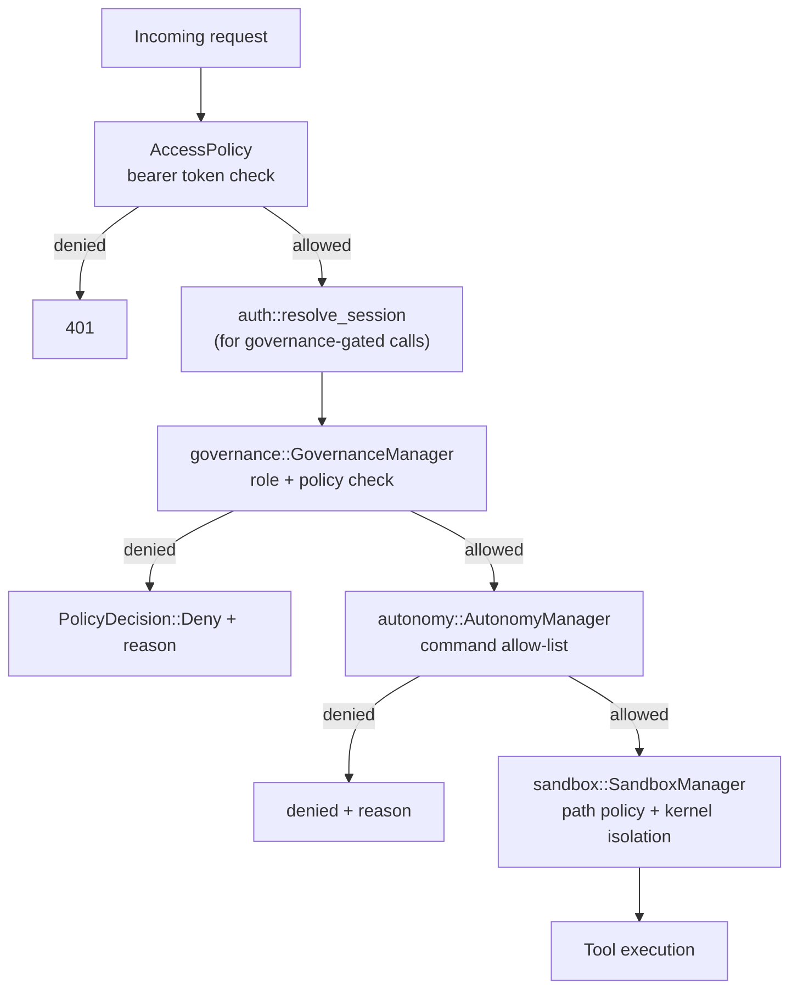

# 031 — Security

## Vision

State what CID's security boundaries actually enforce, and — just as importantly — what
they do not. This document is the detailed companion to the repository's own
`SECURITY.md`; where they overlap, `SECURITY.md` is the canonical, shorter version and
this document adds architectural detail and the real history of what was found and fixed.

## Goals

Four independent boundaries, each with its own guarantees and its own limits:

### 1. Autonomous-mode worktree boundary (`cid-core/src/sandbox/mod.rs`)

Two layers. **Layer 1 (all platforms)**: command path policy — before a process is
spawned, command/argument tokens that are absolute paths or `..`-traversal shapes are
resolved and checked against the Mission's worktree; a `run_terminal` working directory
is clamped into the Mission root regardless of what a model supplies. **Layer 2 (OS
support permitting)**: `sandbox-exec` on macOS and `bubblewrap` on Linux give real kernel
filesystem confinement; Windows Job Objects do not (`sandbox.status`'s `available: false`
on Windows is deliberate and accurate — see ADR 0011).

### 2. Core network access (`cid-core/src/access/mod.rs`)

Loopback bind: open by default, OS is the boundary. Non-loopback bind: **fails at
startup** without a token (`AccessPolicy::new`); both `/api/rpc` and the `/ws` upgrade
require `Authorization: Bearer <token>`, checked in constant time. CORS is an explicit
origin allow-list. See ADR 0012.

### 3. Local accounts and roles (`cid-core/src/auth/mod.rs`)

Argon2id-hashed passwords, opaque 48-char session tokens (12h TTL), a five-tier role
ladder (Viewer < Reviewer < Developer < Admin < Owner). Rate-limited login (5 attempts,
60s lockout). The last Owner cannot be demoted or deactivated. See ADR 0013.

### 4. Workspace governance (`cid-core/src/governance/mod.rs`)

Sits above the sandbox and the autonomy allow-list: decides *who* may enable Autonomous
mode, *which repos* permit it, and enforces spend caps — checked at real decision points
(Mission creation, plan approval), not merely exposed as a checkable RPC.

Plus: role-profile tool-permission enforcement (`008-Agent-Operating-System.md`), secret
redaction in terminal output and history (`redact::redact_secrets`), and OS-native
credential storage for API keys and forge/tracker tokens (never SQLite plaintext).

## Non-Goals

Network isolation and resource limits (`ulimit`/cgroups) for sandboxed commands —
deferred, named explicitly in `SECURITY.md`. Internet-facing authentication (MFA,
password reset, email verification) — ADR 0013's explicit scope boundary; appropriate for
a small trusted-network team, not a public-internet auth system.

## Architecture

## Data Structures

`AccessPolicy`, `AccessDecision` (`access/mod.rs`); `Role`, `Session`, `User`
(`auth/mod.rs`); `WorkspacePolicy`, `PolicyDecision` (`governance/mod.rs`);
`SandboxConfig`, `SandboxResult` (`sandbox/mod.rs`).

## Traits / Interfaces

See each subsystem's own RPC list in `017-Workspace-Manager.md` (governance),
`026-Web-Architecture.md` (access), and `SECURITY.md` (sandbox verification commands).

## Storage Layout

Users/sessions in SQLite (Argon2id hashes, never plaintext); API keys and forge/tracker
tokens in OS-native credential storage via `keyring`; Workspace governance policy
**in-memory only** — a real, named gap (see `017-Workspace-Manager.md`'s Failure Modes).

## Performance Targets

Permission/policy checks are in-memory map lookups or constant-time string comparisons —
no measurable overhead at current scale.

## Tradeoffs

See each ADR (0011, 0012, 0013) for the specific alternatives considered and rejected for
each boundary.

## Failure Modes — the real, found-and-fixed history

This project's security surface has a genuine track record of catching its own gaps
during audit rather than shipping them silently:

1. **Sandbox boundary test was a tautology** (`assert!(passed || !passed)`) and the
   Windows implementation checked only the working directory, not real filesystem access
   — Windows Job Objects don't confine the filesystem at all. Found in the Phase 2
   re-verification, fixed with real path-policy enforcement plus a filesystem-ground-truth
   verification probe. See ADR 0011.
2. **Sandbox was built but never applied to real tool execution** — `execute_tool_with_
   approval` required human approval unconditionally, so Autonomous mode never actually
   ran autonomously and the allow-list was never consulted on the real execution path.
   Fixed by wiring `ExecutionContext` through the actual tool-dispatch code.
3. **Access control was UI state enforcing nothing**, CORS was `Any`. Fixed with
   `access::AccessPolicy` and a real explicit-origin CORS layer. See ADR 0012.
4. **Governance policy checks existed but weren't called** at any real decision point in
   an earlier pass — fixed by wiring `can_enable_autonomous` and `can_approve_plan` into
   `mission.create` and `mission.plan.approve` directly.

Each of these was caught by writing a real integration test against the actual code path
(not just a unit test of the isolated check function) and finding it failed.

## Security

This document is the security document.

## Testing

Sandbox: 13 tests in `sandbox/mod.rs` including
`autonomous_command_cannot_write_outside_the_worktree` (ground-truth filesystem check) and
3 real end-to-end enforcement tests in `model/mod.rs`. Access: 8 tests across
`access/mod.rs` and `api_integration.rs`. Auth: 20 tests in `auth/mod.rs`. Governance: 13
tests in `governance/mod.rs` plus 6 integration tests. Protocol fuzzing (Part 21's Phase
3+ floor): 9 tests in `tests/protocol_fuzz.rs` proving Core never panics or 5xx's on
hostile input across the JSON-RPC, MCP, and ACP boundaries.

## Implementation Order

Sandbox groundwork (Phase 2, corrected same phase) → access control (Phase 2, corrected
same phase) → auth/governance (Phase 3) → no further structural change through Phase 4.

## Acceptance Criteria

Every claim in `SECURITY.md` is backed by a named, currently-passing test — verified as
part of this documentation pass by cross-referencing each claim against
`cargo test --workspace`'s real output (392 tests passing at time of writing).

## AI Coding Rules

Any change to a security-critical path (`sandbox`, `access`, `auth`, `governance`)
requires a real integration test exercising the actual enforcement point, not just a
unit test of the isolated logic — this project's own history shows unit-tests-only
missed real gaps twice.
