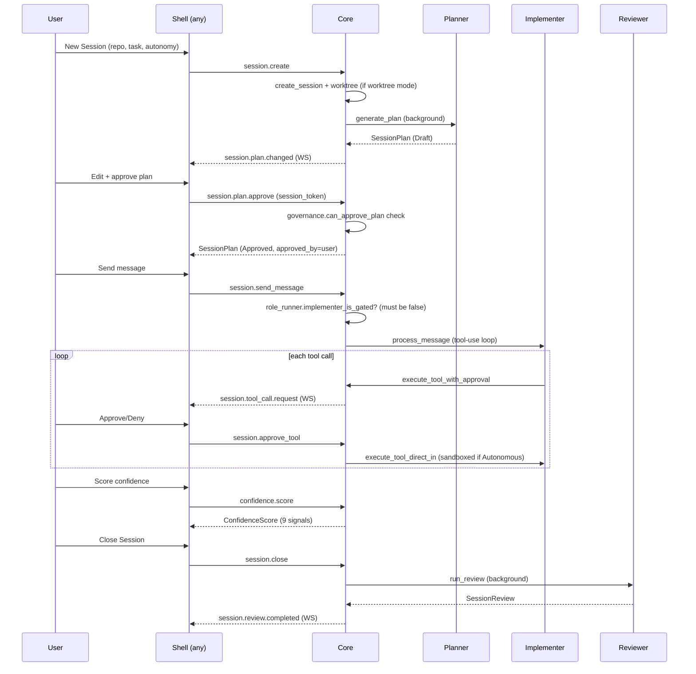
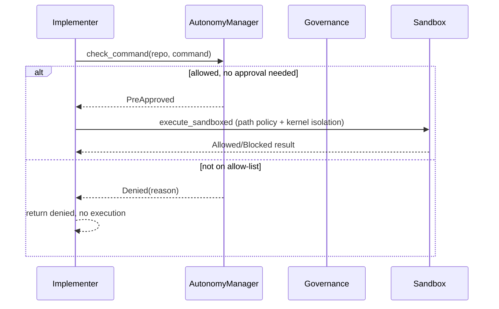

# 043 — Sequence Diagrams

## Vision

The real request/response and event flows for CID's core interactions, as implemented —
not idealized versions.

## Goals

### Flow 1 — Golden path (Session creation through review)

### Flow 2 — Autonomous-mode tool call

Note: `Governance` is checked once at Session-creation time (can this Session even be
Autonomous), not per tool call — per-call gating is the Autonomy allow-list plus Sandbox.

## Non-Goals

Diagramming every RPC method — these two flows are the load-bearing ones; see
`034-API.md` for the full method inventory.

## Architecture

N/A — this document is the architecture-as-sequence view.

## Tradeoffs

N/A.

## Failure Modes

N/A — see the linked subsystem docs for failure-mode detail on each step.

## Security

The Autonomous-mode flow above is the literal security-critical path documented in
`031-Security.md` — this diagram is its concrete companion.

## Testing

Both flows are exercised end-to-end by real tests: Flow 1 by
`co_pilot_session_is_gated_until_a_plan_is_approved` plus
`tests/e2e/flow1.spec.ts`; Flow 2 by `autonomy_denies_a_command_outside_the_allowlist`
and the sandbox integration tests in `model/mod.rs`.

## Implementation Order

N/A.

## Acceptance Criteria

Both diagrams match the real code path as of this document's writing — verified by
cross-referencing against `roles/mod.rs`, `model/mod.rs`, and `autonomy/mod.rs` while
writing them.

## AI Coding Rules

If a flow changes (e.g., governance gets checked per-tool-call instead of at Session
creation), update the corresponding diagram in the same PR — a stale sequence diagram is
actively misleading, worse than none.
