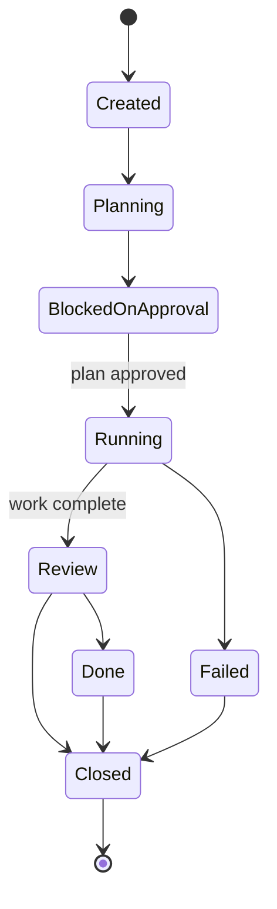
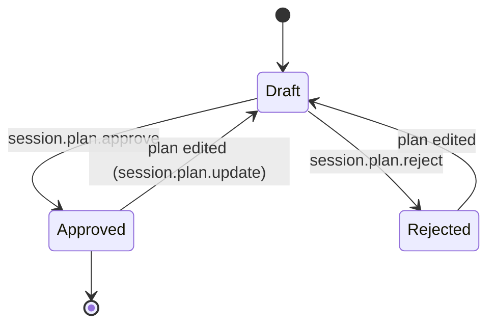
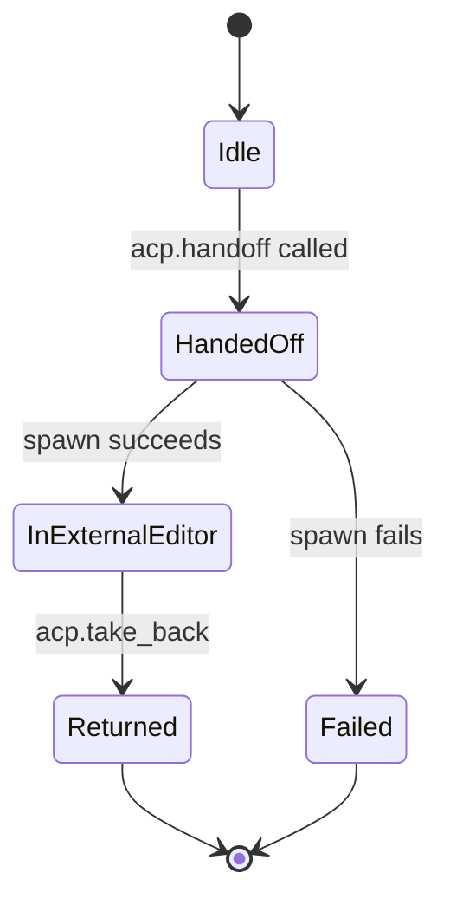

# 044 — State Machines

## Vision

The real state machines governing Sessions, Plans, Reviews, and ACP handoffs — as
implemented in `api/types.rs` and their owning managers.

## Goals

### SessionStatus

`BlockedOnApproval` is entered both while waiting for plan approval and (per
`session.send_message`'s gate) if a message arrives before the plan is approved — the
state name is shared for both cases rather than split into two, since the resolution
(approve the plan) is identical either way.

### SessionPlanStatus

The `Approved → Draft` transition on edit is the specific design choice
`014-Patch-Verification.md`-adjacent `roles/mod.rs` enforces: an approval applied to the
previous text, not whatever replaces it — verified by
`editing_an_approved_plan_revokes_the_approval`.

### AcpHandoffStatus

Taking back does not kill the external editor process — `Returned` reflects CID's own
tracking state, not the external process's actual lifecycle (documented explicitly in
`012-Semantic-Editing.md`'s Tradeoffs).

### ReviewVerdict (not a transition machine — a classification)

`Clean` (no findings) → `CommentsOnly` (findings, none critical) → `ChangesRequested`
(at least one critical finding) → `NotRun` (model unavailable). Not a state machine in the
transition sense — each review run produces exactly one verdict, independent of prior
runs.

## Non-Goals

Diagramming every enum in the codebase — only the ones with real transition logic
(guards, side effects) are state machines worth diagramming; a plain classification enum
like `ReviewVerdict` or `ConfidenceSignal` is listed for completeness but isn't a
transition diagram.

## Architecture

N/A — this document is the state view of the architecture in `004-System-Architecture.md`.

## Tradeoffs

`BlockedOnApproval`'s dual use (see SessionStatus above) trades a slightly overloaded
state name for not introducing a fifth status value for a distinction the UI doesn't
currently need to make.

## Failure Modes

N/A — see each linked subsystem's own Failure Modes section.

## Security

The `SessionPlanStatus` machine is the literal mechanism behind the plan-approval
security gate (`031-Security.md`) — an approval cannot silently carry over to edited
content, which is what `Approved → Draft` on edit exists to prevent.

## Testing

Every transition shown above has a corresponding test:
`co_pilot_session_is_gated_until_a_plan_is_approved`,
`editing_an_approved_plan_revokes_the_approval`,
`rejecting_a_plan_keeps_the_gate_closed`, `acp_handoff_rejects_unknown_session`,
`acp_take_back_requires_a_handoff_id`.

## Implementation Order

N/A.

## Acceptance Criteria

Every state and transition shown matches the real enum definitions in `api/types.rs` and
the real transition logic in their owning managers — verified by cross-reference while
writing this document.

## AI Coding Rules

If you add a new state or transition to any of these machines, update the diagram in the
same change — and add a test for the new transition, following the pattern every existing
transition already has.
